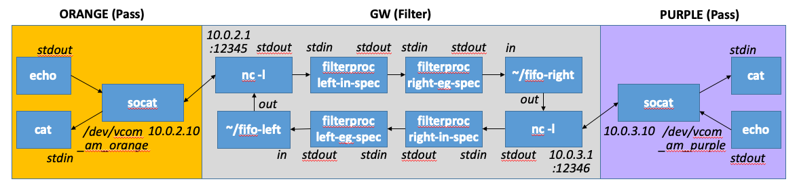
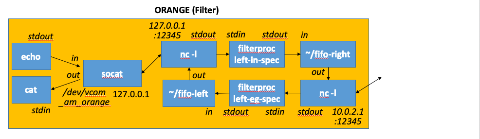

# Design Notes

The purpose of the GAPS emulator is test and evaluation of cross-domain systems built using GAPS software toolchains within emulated distributed environments with heterogeneous instruction set architectures and/or application binary architectures, multiple enclaves running with different information security requirements, interconnected by cross-domain guard hardware. The emulator will be built using NRL CORE (supporting distributed/networked scenarios and a convenient GUI) and QEMU (for emulating different processor architectures). 

Although the emulator will use virtual ethernets/802.11 for interconnection, real devices may use other (possibly proprietary) on-wire protocols; if needed, the actual framing/protocol employed can be emulated in software on top of the underlying virtual Ethernet.

In the following description, "TA1" denotes various kinds of cross-domain guard hardware, which may be implemented either using a bump-in-the-wire model or a bookends model (i.e., a card on a host on either side).

## Bump-In-The-Wire Model


1. If x86, QEMU and bridges can be dropped optionally; cross-domain application program, gpsd, and TA1 char dev will run directly on CORE node
2. Guard functions can be implemented using iptables initially that port forwards from 10.0.1.2:8080 to 10.1.1.2:8080; later, it could be implemented as a process that reads 10.0.1.2:8080 and 10.1.1.2:8080 and applies guard functions before transmitting. If vendor support is available, QEMU emulations of the device can be considered as well. Our architecture supports all these possibilities.
3. Cross domain program could directly open /dev/virtualcom0 and read/write cross-domain data to it; however it is desirable that a messaging middleware (e.g., based on zmq) is employed to allow multiplexing traffic from multiple applications over the same cross-domain interconnection.
4. Cross-domain program may communicate to gpsd and other processed on the host; it may communicate (e.g., via eth1) to services on other nodes in the enclave 
5. Note the use of L2 bridges, we envision that only the QEMU side has an IP address
6. Although one cross-domain connection is shown, the architecture will support cross-domain devices/connections to multiple peer enclaves

## Bookend Model


In bookends model, socat sends virtual device to a local address/port; TA1 guard functions reads that port and write to eth0 (and vice versa). Only the QEMU isnide the CORE node is shown, but the rest of the scenario is the same as in the BITW case, except the cross-domain CORE router is a simple pass through in the Bookends case.

The recipe for creating a virtual serial device using `socat` is as follows:
```
# On terminal 1  (notionally TA1 hardware side):
$ nc -4 -k -t -l localhost 12345

# On terminal 2 (notionally host side):
$ sudo bash
$ socat pty,link=/dev/virtualcom0,raw tcp:localhost:12345 & 
$ yes 'Hello, World!' > /dev/virtualcom0

# You should now see on terminal 1:
Hello, World!
Hello, World!
...

```

## Bidirectional BITW Pass-through

A gateway can pass data between enclaves, which cannot directly route to each other, by using netcat commands to listen to each enclave.
```
mkfifo fifo
nc -4 -k -t -l 10.0.1.2 12345 < fifo | nc -4 -k -t -l 10.1.1.2 12345 > fifo
```

An example of using this in CORE, with 'socat' links, is shown below:


```
DEV_ORANGE="/dev/vcom_am_or"
GW_ORANGE_IP="10.0.2.1"
GW_ORANGE_PORT="12345"

DEV_PURPLE="/dev/vcom_am_pu"
GW_PURPLE_IP="10.0.3.1"
GW_PURPLE_PORT="12346"

#gw
        mkfifo fifo
        nc -4 -k -l ${GW_ORANGE_IP} ${GW_ORANGE_PORT} \
          < fifo \
          | nc -4 -k -l ${GW_PURPLE_IP} ${GW_PURPLE_PORT} \
          > fifo &
          
#orange 
   terminal-1:
        socat -d -d -lf /tmp/mylogs-o.log \
          pty,link=${DEV_ORANGE},raw,ignoreeof,unlink-close=0,echo=0 \
          tcp:${GW_ORANGE_IP}:${GW_ORANGE_PORT} &
        sleep 1
        cat ${DEV_ORANGE}
   terminal-2:
        echo "Orange sends a message" > ${DEV_ORANGE}
        
#purple 
   terminal-1:
        socat -d -d -lf /tmp/mylogs-p.log \
          pty,link=${DEV_PURPLE},raw,ignoreeof,unlink-close=0,echo=0 \
          tcp:${GW_PURPLE_IP}:${GW_PURPLE_PORT} &
        sleep 1
        cat ${DEV_PURPLE}
   terminal-2:
        echo "Purple sends a message" > ${DEV_PURPLE}
```

## Bidirectional BITW filter

The gateway can control data passing between enclaves by adding a filter in the forward and reverse paths. The figure below gives an example, with a filter (filterproc.py) that takes a spec, reads from stdin, filters according to spec, then writes to stdout.



```
#gw
        nc -4 -k -l ${GW_ORANGE_IP} ${GW_ORANGE_PORT} \
          < fifo-left \
          | python3 filterproc.py left-ingress-spec   \
          | python3 filterproc.py right-egress-spec   \
          > fifo-right &
        nc -4 -k -l ${GW_PURPLE_IP} ${GW_PURPLE_PORT} \
          < fifo-right \
          | python3 filterproc.py right-ingress-spec  \
          | python3 filterproc.py left-egress-spec    \
          > fifo-left &
```

Only the gateway node processing pipeline is enhanced from the pass-through case (the orange and purple nodes are unchanged).


## Bidirectional BOOKEND filter

The filter function can be moved into the end nodes. For example, the figure below shows one possible implementation on the orange node.



```
Not yet tested
```

# Installation Notes
## Install Prerequisites

The process is manual now, but we may wrap this in a convenient install-all script in the future.

```
# Assumes Ubuntu Linux (preferably 19.10)
# Install CORE emulator, QEMU, and other prerequsitie Ubuntu packages
sudo apt update
sudo apt -y upgrade
sudo apt install python3 python3-pip
sudo apt install build-essential libssl-dev libffi-dev python3-dev
sudo apt install python3-venv
sudo apt install bash bridge-utils ebtables iproute libev-dev python tcl8.5 tk8.5 libtk-img xterm mgen traceroute
sudo apt install ethtool
sudo apt install qemu
sudo apt install qemu-efi
sudo apt install quagga
sudo apt install socat
wget https://github.com/coreemu/core/releases/download/release-5.5.2/requirements.txt
sudo python3 -m pip install --upgrade
sudo -H pip3 install -r requirements.txt 
wget https://github.com/coreemu/core/releases/download/release-5.5.2/core_python3_5.5.2_amd64.deb
dpkg -i core_python3_5.5.2_amd64.deb 

# Download ISO live-server images for Ubuntu 19.10 for both amd64 and arm64
# from https://ubuntu.com/download/server and https://ubuntu.com/download/server/arm
wget http://cdimage.ubuntu.com/releases/19.10/release/ubuntu-19.10-server-amd64.iso
wget http://cdimage.ubuntu.com/releases/19.10/release/ubuntu-19.10-server-arm64.iso

# Create virtual disks and install Linux for AMD64, with user closure
qemu-img create -f qcow2 ubuntu-19.10-amd64.qcow2 20G
sudo qemu-system-x86_64 -enable-kvm -m 4G -smp 2 -boot d -cdrom ubuntu-19.10-server-amd64.iso -drive "file=ubuntu-19.10-amd64.qcow2,format=qcow2"
qemu-img create -f qcow2 -b ubuntu-19.10-amd64.qcow2 ubuntu-19.10-amd64-snapshot.qcow2 
chmod ugo-w ubuntu-19.10-amd64.qcow2

# Boot the snapshot and configure it for use in the emulator
sudo qemu-system-x86_64 -enable-kvm -m 4G -smp 2 -drive "file=ubuntu-19.10-amd64-snapshot.qcow2,format=qcow2" 
# Login to the VM and add a serial console
sudo bash
vi /etc/default/grub
# Change GRUB_CMDLINE_LINUX="" to GRUB_CMDLINE_LINUX="console=ttyS0" in /etc/default/grub
update-grub
halt

# Now boot without graphics (works inside CORE node also)
# Note a NAT-ted ehternet is creted automagically -- so for example, you can loacl pacakges from Internet
sudo qemu-system-x86_64 -enable-kvm -m 4G -smp 2 -drive "file=ubuntu-19.10-amd64-snapshot.qcow2,format=qcow2" -nographic

# Create virtual disks and install Linux for ARM64
# XXX: steps below are not working ywt, ARM is TBD
qemu-img create -f qcow2 ubuntu-19.10-arm64.qcow2 20G
wget http://snapshots.linaro.org/components/kernel/leg-virt-tianocore-edk2-upstream/latest/QEMU-AARCH64/RELEASE_GCC5/QEMU_EFI.img.gz
gunzip QEMU_EFI.img.gz
qemu-img create -f qcow2 varstore.img 64M
qemu-system-aarch64 \
    -cpu cortex-a53 -M virt -m 4G -nographic -smp 2 \
    -drive if=pflash,format=raw,file=QEMU_EFI.img \
    -drive if=pflash,file=varstore.img \
    -drive "file=ubuntu-19.10-arm64.qcow2,format=qcow2" \
    -drive "if=virtio,format=raw,file=ubuntu-19.10-server-arm64.iso"

# qemu-img create -f qcow2 -b ubuntu-19.10-arm64.qcow2 ubuntu-19.10-arm64-snapshot.qcow2 
# qemu-system-aarch64 \
#    -cpu cortex-a53 -M virt -m 4G -nographic -smp 2 \
#    -drive "if=virtio,format=raw,file=ubuntu-19.10-server-arm64.iso"

```

Plumbing the QEMU node to the CORE node is done as follows (needs to be scripted):
```
# Inside the CORE node:
ip addr del 10.0.2.10/32 dev eth1
tunctl -t qemutap0
brctl addbr br0
brctl addif br0 qemutap0
brctl addif br0 eth1
ifconfig qemutap0 up
ifconfig br0 up

tunctl -t qemutap1
brctl addbr br1
brctl addif br1 qemutap1
# Additional configuration as with br0 to be done here ...

# additional software such as socat ifconfig would be good to have

sudo qemu-system-x86_64 -enable-kvm -m 1G -smp 1 -drive file=ubuntu-19.10-amd64-snapshot.qcow2,format=qcow2 -net nic -net tap,ifname=qemutap0,script=no,downscript=no -net nic -net tap,ifname=qemutap1,script=no,downscript=no -nographic

# Inside the qemu (login as user closure:
sudo bash
ip addr flush ens3
ip addr add 10.0.2.10 dev ens3
ip route add 10.0.2.0/24 dev ens3
ping 10.0.2.10  # self
ping 10.0.2.1   # cross-domain-gw

```

## GAPS Emulator installation
To be added.

# Todo
1. Prepare QEMU image for x86 with Ubuntu 19.10
    * DONE, but will be nice to have a scripted process
2. Prepare QEMU image for ARM with Ubuntu 19.10
    * XXX: UNABLE to BOOT from ISO
3. Create a sample IMN file using CORE GUI
    * DONE, but will need to be refined, and eventually auto-generated
4. Implement sample TA1 device emulators (pass,BITW,BKEND)
    * Reuse BKEND impl. to create BITW
    * Include stats and wire-shark support
    * Design is done (see above), plumbing remains) -- also filterproc needs to be written
5. Protoype the end-to-end QEMU build and sample scenario
    * Plumbing the QEMU (see above)
    * Automated scripting
    * Fully scripted install and config over network
    * Faster boot
    * Back-channel management network to qemu for monitoring and software install
    * Scripted network plumbing and cross-domain plumbing
6. Prepare a sample partitioned program: 
    * Include install script (e.g., deb package)
    * Include systemd scripts that will start application on boot and respawn on failure
    * Include a toy library for cross-domain messaging (should work on serial with framing TBD as well as Ethernet+IP)

7. Create a JSON configuration file containing:
    * Hardware topology for all enclaves and cross-domain devices; must specify number of cores, architecture etc. for the hosts 
    * TA1 device capabilities and type, e.g.,
    * ID (pass-through)
    * BITW style
    * Bookends style
    * Specific guard functions supported on device
    * Software topology and mappings – names of executables and which node they will run on
8. From the JSON generate IMN + scripting for GAPS scenario
    * Read in JSON file
    * Instantiate CORE nodes, do the necessary internal plumbing (for either BITW or Bookends style), and deploy application
    * Instantiate QEMU nodes and do needed plumbing
    * Manage GAPS components (application, gpsd, TA1 device emulation)
    * Configure TA1 device (control API)
    * Preferably, write the above functionality as a Python library (not a monolithic script)
9. Basic GUI for the JSON config?
    * Nice to have, maybe Phase 2

