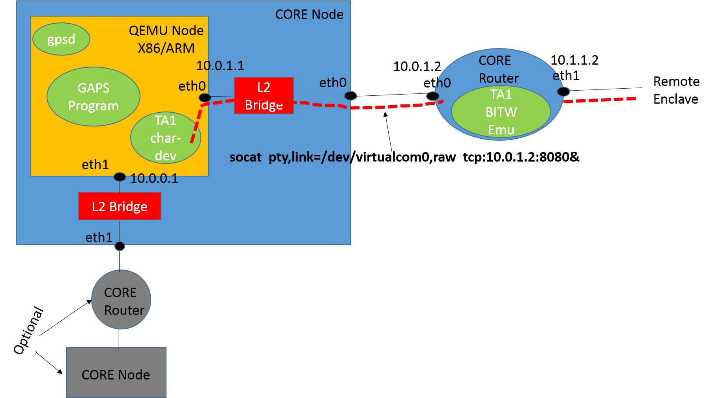
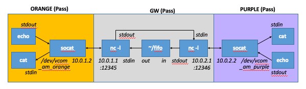
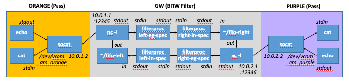
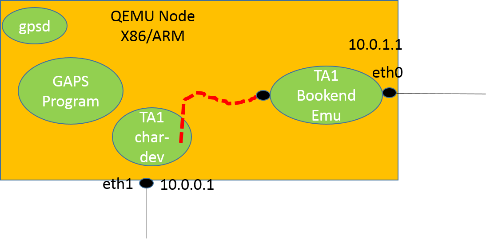
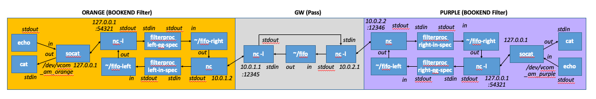

# Design Notes

The purpose of the GAPS emulator is test and evaluation of cross-domain systems built using GAPS software toolchains within emulated distributed environments with heterogeneous instruction set architectures and/or application binary architectures, multiple enclaves running with different information security requirements, interconnected by cross-domain guard hardware. The emulator will be built using NRL CORE (supporting distributed/networked scenarios and a convenient GUI) and QEMU (for emulating different processor architectures). 

Although the emulator will use virtual ethernets/802.11 for interconnection, real devices may use other (possibly proprietary) on-wire protocols; if needed, the actual framing/protocol employed can be emulated in software on top of the underlying virtual Ethernet.

In the following description, "TA1" denotes various kinds of cross-domain guard hardware, which may be implemented either using a bump-in-the-wire model or a bookends model (i.e., a card on a host on either side).

## Bump-In-The-Wire Model



1. If x86, QEMU and bridges can be dropped optionally; cross-domain application program, gpsd, and TA1 char dev will run directly on CORE node. A virtual serial device can be created using `socat` which can talk to a remote `nc` process on the BITW device.
2. Guard functions are implemented using simple sed/grp style filters that read from stdin and write to stdout; later, enhanced options can be considered as discussed towards the end of this document. If vendor support is available, QEMU emulations of the device, device drivers, or hardware-in-the-loop can be considered as well. Our architecture supports all these possibilities.
3. Cross domain program could directly open /dev/virtualcom0 and read/write cross-domain data to it; however it is desirable that a messaging middleware (e.g., based on zmq) is employed to allow multiplexing traffic from multiple applications over the same cross-domain interconnection.
4. Cross-domain program may communicate to gpsd and other processed on the host; it may communicate (e.g., via eth1) to services on other nodes in the enclave 
5. Note the use of L2 bridges, we envision that only the QEMU side has an IP address
6. Although one cross-domain connection is shown, the architecture will support cross-domain devices/connections to multiple peer enclaves

### Bidirectional BITW Pass-through

A gateway can pass data between enclaves, which cannot directly route to each other, by using netcat commands to listen to each enclave.
```
mkfifo fifo
nc -4 -k -t -l 10.0.1.2 12345 < fifo | nc -4 -k -t -l 10.1.1.2 12345 > fifo
```

An example of using this in CORE, with 'socat' links, is shown below:



```
DEV_ORANGE="/dev/vcom_am_orange"
SOCAT_ORANGE_LOGS="/tmp/socat_am_orange.log"
GW_ORANGE_IP="10.0.1.1"
GW_ORANGE_PORT="12345"

DEV_PURPLE="/dev/vcom_am_purple"
SOCAT_PURPLE_LOGS="/tmp/socat_am_purple.log"
GW_PURPLE_IP="10.0.2.1"
GW_PURPLE_PORT="12346"

#gw
        mkfifo fifo
        nc -4 -k -l ${GW_ORANGE_IP} ${GW_ORANGE_PORT} \
          < fifo \
          | nc -4 -k -l ${GW_PURPLE_IP} ${GW_PURPLE_PORT} \
          > fifo &
          
#orange 
   terminal-1:
        socat -d -d -lf ${SOCAT_ORANGE_LOGS} \
          pty,link=${DEV_ORANGE},raw,ignoreeof,unlink-close=0,echo=0 \
          tcp:${GW_ORANGE_IP}:${GW_ORANGE_PORT},ignoreeof &
        sleep 1
        cat ${DEV_ORANGE}
   terminal-2:
        echo "Orange sends a message" > ${DEV_ORANGE}
        
#purple 
   terminal-1:
        socat -d -d -lf ${SOCAT_PURPLE_LOGS} \
          pty,link=${DEV_PURPLE},raw,ignoreeof,unlink-close=0,echo=0 \
          tcp:${GW_PURPLE_IP}:${GW_PURPLE_PORT},ignoreeof &
        sleep 1
        cat ${DEV_PURPLE}
   terminal-2:
        echo "Purple sends a message" > ${DEV_PURPLE}
```

### Bidirectional BITW filter

The gateway can control data passing between enclaves by adding a filter in the forward and reverse paths. The figure below gives an example, with a filter (filterproc.py) that takes a spec, reads from stdin, filters according to spec, then writes to stdout.



```
#gw
        mkfifo fifo-left
        mkfifo fifo-right
        nc -4 -k -l ${GW_ORANGE_IP} ${GW_ORANGE_PORT} \
          < fifo-left \
          | python3 filterproc.py left-ingress-spec   \
          | python3 filterproc.py right-egress-spec   \
          > fifo-right &
        nc -4 -k -l ${GW_PURPLE_IP} ${GW_PURPLE_PORT} \
          < fifo-right \
          | python3 filterproc.py right-ingress-spec  \
          | python3 filterproc.py left-egress-spec    \
          > fifo-left &
```

Only the gateway node processing pipeline is enhanced from the pass-through case (the orange and purple nodes are unchanged). The addition of the second fifo (fifo-right) enables splitting the script into two separate (more symmetrical and easy to comprehend) commands; but this could also have been written with one fifo (and one line), as with the pass-through example above.

## Bookend Model



In bookends model, socat sends virtual device to a local address/port; TA1 guard functions reads that port and write to eth0 (and vice versa). Only the QEMU isnide the CORE node is shown, but the rest of the scenario is the same as in the BITW case, except the cross-domain CORE router is a simple pass through in the Bookends case. 

### Bidirectional BOOKEND filter

The filter function is split and moved into the devices on the two end nodes. For example, the figure below shows one possible implementation on the orange node.



**FIXME: The naming of the filter specs ingress/egress is confusing (it is correct in the BITW. The nc at the egress should be a client not a listener (drop -l).**

```
Code to be specified.
```

# Dependencies Installation and QEMU VM Disk Image Creation and OS Installation Notes

We have developed a non-interactive script that automatically builds QEMU VM images, and installs Ubuntu, and configures it.
The scripted process is much easier to use and less error-prone. Our initial process was manual, and details are documented at the end as some of the information could be useful during development. 

Using the `build_qemu_vm_images.sh` script we fetch the kernels, build and minimally configure the VM disk images, and then save a golden copy of the kernels and images. Then using `emulator_customize.sh`, we take snapshots of the images and customize them for use wihtin the emulator as needed.  The script can optionally also install pre-requisites and NRL CORE on the build server.

```
./build_qemu_vm_images.sh -h
# Usage: ./build_qemu_vm_images.sh [ -h ] [ -p ] [ -c ] \
#           [ -a QARCH ] [ -d UDIST ] [-s SIZE ] [-k KDIST ]
# -h        Help
# -p        Install pre-requisites on build server
# -c        Intall NRL CORE on build server
# -a QARCH  Architecture [arm64(default), amd64]
# -d UDIST  Ubuntu distro [eoan(default)]
# -s SIZE   Image size [20G(default),<any>]
# -k KDIST  Ubuntu distro for kernel [xenial(default),<any>]
```

Ensure sudo group is allowed to work without passwords, otherwise expect scripting will fail on sudo.
First create a virgin image for each architecture for the supported distro (currently eoan):

```
# AMD64, use -p option for first time to ensure prerequisites are installed
./build_qemu_vm_images.sh -p -a amd64 -d eoan -k eoan -s 20G
# ARM64
./build_qemu_vm_images.sh -a arm64 -d eoan -k xenial -s 20G
```

This will fetch the kernel (e.g., linux-kernel-amd64-eoan), initrd (linux-initrd-amd64-eoan.gz), and build the virgin qemu vm image (e.g., ubuntu-amd64-eoan-qemu.qcow2.virgin) using debootstrap.

Now configure the virgin image to make it usable generally with user networking support (allows host-based NAT-ted access to Internet):

```
# AMD64
./build_qemu_vm_images.sh -a amd64 -d eoan -k eoan -s 20G -u
# ARM64
./build_qemu_vm_images.sh -a arm64 -d eoan -k xenial -s 20G -u
```

You should find the golden copy (e.g., ubuntu-amd64-eoan-qemu.qcow2) created.  This image and the associated kernel should be saved to a common location (e.g., /IMAGES) and the files should be made read-only.  Any use of this for the emulator will first involve snapshotting and further configuration.

Optionally, take a test snapshot, boot into it, and login as closure user.

```
cd ./build
qemu-img create -f qcow2 -b ubuntu-amd64-eoan-qemu.qcow2 test-snapshot.qcow2
sudo qemu-system-x86_64 -nographic -enable-kvm -m 4G -smp 2 -drive file=test-snapshot.qcow2,format=qcow2 -net nic -net user -kernel linux-kernel-amd64-eoan -append "earlycon console=ttyS0 root=/dev/sda rw"
```

From the build directory, move golden images to a common directory `/IMAGES` and make read-only.
```
cd ./build
sudo cp linux-kernel-amd64-eoan /IMAGES
sudo cp linux-kernel-arm64-xenial /IMAGES
sudo cp ubuntu-amd64-eoan-qemu.qcow2 /IMAGES
sudo cp ubuntu-arm64-eoan-qemu.qcow2 /IMAGES
sudo chown root.root /IMAGES/linux-kernel-* /IMAGES/ubuntu-*.qcow2 
sudo chmod 444 /IMAGES/linux-kernel-* /IMAGES/ubuntu-*.qcow2
```

Finally create a snapshot for each node in the scenario with corresponding architecture, netplan, and CLOSURE software.

```
./emulator_customize.sh -h
# Usage: ./emulator_customize.sh [ -h ] \
#           [ -g GIMG ] [ -k KRNL ] [-o OFIL ] [-a QARCH]
# -h        Help
# -g GIMG   Full path to golden image, required
# -k KRNL   Full path to kernel, required
# -o OFIL   Name of output snapshot, required
# -a QARCH  Architecture [arm64(default), amd64]

# To create an amd64 instance for use in CLOSURE emulation scenario
./emulator_customize.sh -g /IMAGES/ubuntu-amd64-eoan-qemu.qcow2 \
                        -k /IMAGES/linux-kernel-amd64-eoan \
                        -a amd64 \
                        -o snap.qcow2 \
                        -n /home/rkrishnan/gaps/top-level/emulator/config/qemu_config_netplan_core_x86.txt 
                        
# To create an arm64 instance for use in CLOSURE scenario
./emulator_customize.sh -g /IMAGES/ubuntu-arm64-eoan-qemu.qcow2 \
                        -k /IMAGES/linux-kernel-arm64-xenial \
                        -a arm64 \
                        -o snap1.qcow2 \
                        -n /home/rkrishnan/gaps/top-level/emulator/config/qemu_config_netplan_core_arm.txt 

```

The `emulator_customize.sh` script creates `snap.cow2` and `snap1.cow` in the `build` subdirectory. he emulation scenario generator will call this script and may use a different output filename for the snapshot. The script uses the keypair `id_closure_rsa`/`id_closure_rsa.pub` from the `build` directory, and newly creates them if they are missing. Make sure all images for emulation scenario use same key. 

Software installation such as zmq-cat and other CLOSURE software has been deferred to the emulation scenario -- it can install software via ssh over the management interface included in the netplan.


# Plumbing QEMU node inside CORE node for emulator 
Plumbing the QEMU node to the CORE node is done as follows. This will need to be scripted as well.

```
# Inside the CORE node

# Setup for cross-domain link
ip addr flush dev eth1
tunctl -t qemutap0
brctl addbr br0
brctl addif br0 qemutap0
brctl addif br0 eth1
ifconfig qemutap0 up
ifconfig br0 up

# Setup for intra-domain link
ip addr flush dev eth0
tunctl -t qemutap1
brctl addbr br1
brctl addif br1 qemutap1
brctl addif br1 eth0
ifconfig qemutap1 up
ifconfig br1 up

# Setup for management link, same on all nodes
tunctl -t qemutap2
tunctl -t qemutap2
ip link set qemutap2 up
ip addr add 10.200.0.2 dev qemutap2
ip route add 10.200.0.0/24 dev qemutap2
```

```
# Start QEMU node within CORE node for AMD64, orange
sudo qemu-system-x86_64 -nographic -enable-kvm -M virt -m 1G -smp 1 \
  -drive file=ubuntu-19.10-amd64-snapshot1.qcow2,format=qcow2 \
  -net nic -net tap,ifname=qemutap0,script=no,downscript=no \
  -net nic -net tap,ifname=qemutap1,script=no,downscript=no \
  -net nic -net tap,ifname=qemutap2,script=no,downscript=no

# Symbolically link linux-kernel-arm64-xenial from /IMAGES to your working directory

# Start QEMU node within CORE node for ARM64, purple
# Note need for external kernel and root device is /dev/vda
# Serial console is ttyS0 in AMD64, but ttyAMA0 in ARM64
sudo qemu-system-aarch64 -nographic -M virt -cpu cortex-a53 -m 1024 \
  -drive file=ubuntu-19.10-arm64-snapshot1.qcow2,format=qcow2 \
  -kernel /linux-kernel-arm64-xenial -append 'earlycon root=/dev/vda rw' \
  -netdev tap,id=unet0,ifname=qemutap0,script=no,downscript=no -device virtio-net-device,netdev=unet0 \
  -netdev tap,id=unet1,ifname=qemutap1,script=no,downscript=no -device virtio-net-device,netdev=unet1 \
  -netdev tap,id=unet2,ifname=qemutap2,script=no,downscript=no -device virtio-net-device,netdev=unet2
```

From CORE node, you can ssh into QEMU VM using:
```
ssh -i /home/amcauley/gaps/top-level/emulator/config/id_rsa closure@10.200.0.1 \
  sudo socat -d -d -lf ${LOG} \
  pty,link=${DEV_PTY},raw,ignoreeof,unlink-close=0,echo=0 \
  tcp:${GW_IP}:${GW_PORT},ignoreeof &
sleep 1
ssh -i /home/amcauley/gaps/top-level/emulator/config/id_rsa closure@10.200.0.1 \
  sudo chmod 666 ${DEV_PTY}
```

From the host, you can invoke a vcmd into the CORE node, and then ssh/scp into QEMU node to run a command / add a file.
We can install the application .deb package for the scenario this way using dpkg -i (via ssh and vcmd).

```
## GAPS Emulator installation instructions
To be added.
```

## Future Work
### Realistic Guard Emulation 

The initial emulator will use a simple line-oriented grep/sed style filter to do a proof-of-concept guard.  Looking ahead, we anticipate:
  * Being able to integrate TA1 hardware in the loop into our emulation
  * Being able to include a Linux device driver that emulates the TA1 devices more faithfully, possibly with QEMU emulation of the TA1 device itself
  * A more full-featured emulation of a guard using Linux kernel networking capabilities, for example, [using tc and eBPF] (https://archive.fosdem.org/2016/schedule/event/ebpf/attachments/slides/1159/export/events/attachments/ebpf/slides/1159/ebpf.pdf)
  * A variant of the above approach is to target the eBPF or P4 solution to SmartNIC hardware
    
However, if a full hardware testbed is available to us, the need for full-featured emulation of guard functionality is diminished.

# Todo
0. Documentation -- DONE, this document
    * Needs to be reviewed and brought up to date with current state of emulator 
1. Prepare QEMU image for x86 with Ubuntu 19.10 -- DONE, superseded by script
2. Prepare QEMU image for ARM with Ubuntu 19.10 -- DONE, superseded by script
    * Check if we can switch to eoan kernel with the newer qemu 4.0.0 on jaga/eoan
3. Fully automated (non-interactive) script for building VM images for specific arch and distro --DONE
    * DONE, script to build ARM64 and AMD64 qemu VM images tested for eoan
4. Create a sample IMN file using CORE GUI, DONE, sample 2 enclave scenario checked in
    * Need to shadown /root directory and invoke scripts to do actual GAPS emulation tasks
5. Implement sample TA1 device emulators (pass,BITW,BKEND) -- DONE
    * BKEND fully worked out, not tested
    * filterproc is line-oriented and is a stub -- rethink using packrat parsing or other means
    * must include stats and wire-shark support
6. Protoype the end-to-end QEMU build and sample scenario manually, DONE
    * Integrate HAL (TA2-TA1 interface) and GAPS application and test
7. Prepare a sample partitioned program, IN-PROGRESS 
    * Include install script (e.g., deb package)
    * Include systemd scripts that will start application on boot and respawn on failure
    * Include a toy library for cross-domain messaging (should work on serial with framing TBD as well as Ethernet+IP)
8. Create a high level configuration file, DONE
    * Hardware topology for all enclaves and cross-domain devices; must specify number of cores, architecture etc.
    * Intra-enclave links
    * Cross-domain interconnections: type and configuration
    * Software topology: executables and which node they will run on
9. From the configuration generate IMN + scripting for GAPS scenario, PARTIAL
    * Reads in config file and generates IMN
    * Shadowing /root, adding /root/.ssh/config to ignore StrictHostChecking on CORE node, add emulation scripts
    * Auto start of emulation scripts using cmdup 
    * Call script to customizing VM snapshots for each xdhost
    * Call script for L2 bridge and tap plumbing and invocation of qemu-system on CORE node
    * May want to use a good nice value for the ARM64 instances
    * Call script to check if QEMU VMs are ready, i.e., booted and accepting ssh connections
    * Call script to plumb the TA1 emulation for BKEND, BITW, or PASSTHRU
    * Call script to install latest CLOSURE software: CLOSURE libraries/utilities, HAL service, GAPS demo application
    * all script to initiate (i) the HAL service, and (ii) the CLOSURE application, e.g., via "systemctl restart" 
10. Script that spits out the config JSON and layout for "common case 2,3,4 enclave scenarios 
    * Use same structure for all enclaves
    * enclaves placed one per quadrant, each with different color
    * full mesh of xdlink connections across enclaves
    * provide option to use single xdhost with multiple links or separate xdhost for each link in the enclaves


# APPENDIX 1: Manual Dependency Installation, QEMU VM image building, and configuration (DEPRECATED)

These steps have been scripted (or about to be scripted soon), please use the scripts.

## Install prerequisites on build and run machine (DEPRECATED)


```
# Assumes Ubuntu Linux (preferably 19.10)
# Install CORE emulator, QEMU, and other prerequsitie Ubuntu packages
sudo apt update
sudo apt -y upgrade
sudo apt install python3 python3-pip
sudo apt install build-essential libssl-dev libffi-dev python3-dev
sudo apt install python3-venv
sudo apt install bash bridge-utils ebtables iproute libev-dev python tcl8.5 tk8.5 libtk-img xterm mgen traceroute
sudo apt install ethtool
sudo apt install qemu
sudo apt install qemu-efi
sudo apt install quagga
sudo apt install ubuntu-dev-tools
wget https://github.com/coreemu/core/releases/download/release-5.5.2/requirements.txt
sudo python3 -m pip install --upgrade
sudo -H pip3 install -r requirements.txt 
wget https://github.com/coreemu/core/releases/download/release-5.5.2/core_python3_5.5.2_amd64.deb
dpkg -i core_python3_5.5.2_amd64.deb 
sudo -H pip3 install pexpect
```

## VM Building Approach #1: Building images from ISO (DEPRECATED)
```
# Download ISO live-server images for Ubuntu 19.10 for both amd64 and arm64
# from https://ubuntu.com/download/server and https://ubuntu.com/download/server/arm
wget http://cdimage.ubuntu.com/releases/19.10/release/ubuntu-19.10-server-amd64.iso
wget http://cdimage.ubuntu.com/releases/19.10/release/ubuntu-19.10-server-arm64.iso

# Create virtual disks and install Linux for AMD64, with user closure
qemu-img create -f qcow2 ubuntu-19.10-amd64.qcow2 20G
sudo qemu-system-x86_64 -enable-kvm -m 4G -smp 2 -boot d -cdrom ubuntu-19.10-server-amd64.iso -drive "file=ubuntu-19.10-amd64.qcow2,format=qcow2"
chmod ugo-w ubuntu-19.10-amd64.qcow2

# Save the VM for future use after adding serial console support
cp ubuntu-19.10-amd64.qcow2 /IMAGES/ubuntu-19.10-amd64-goldencopy.qcow2
sudo chmod ugo+w /IMAGES/ubuntu-19.10-amd64-goldencopy.qcow2
sudo qemu-system-x86_64 -enable-kvm -m 4G -smp 2 -drive "file=/IMAGES/ubuntu-19.10-amd64-goldencopy.qcow2,format=qcow2"
# login to the VM as closure and update grub
sudo bash
vi /etc/default/grub
# Change GRUB_CMDLINE_LINUX="" to GRUB_CMDLINE_LINUX="console=ttyS0" in /etc/default/grub
update-grub
halt
sudo chmod ugo-w /IMAGES/ubuntu-19.10-amd64-goldencopy.qcow2

qemu-img create -f qcow2 -b /IMAGES/ubuntu-19.10-amd64-goldencopy.qcow2 ubuntu-19.10-amd64-snapshot.qcow2 

# Test booting snapshot without graphics; a user network is automagically created and you can access the Internet via the host
sudo qemu-system-x86_64 -enable-kvm -m 4G -smp 2 -drive "file=ubuntu-19.10-amd64-snapshot.qcow2,format=qcow2" -nographic
```

While the approach worked successfully for x86, installation from ISO for ARM64 (steps below) ran into several challenges, such as the need for EFI and an external kernel. Also newer kernels kept crashing on the build server (workhorse, which is xenial-based), so we could not go past the splash screen.  This may work better on a build server with a more recent distribution.

```
# Create virtual disks and install Linux for ARM64
qemu-img create -f qcow2 ubuntu-19.10-arm64.qcow2 20G
wget http://snapshots.linaro.org/components/kernel/leg-virt-tianocore-edk2-upstream/latest/QEMU-AARCH64/RELEASE_GCC5/QEMU_EFI.img.gz
gunzip QEMU_EFI.img.gz
qemu-img create -f qcow2 varstore.img 64M
qemu-system-aarch64 \
    -cpu cortex-a53 -M virt -m 4G -nographic -smp 2 \
    -drive if=pflash,format=raw,file=QEMU_EFI.img \
    -drive if=pflash,file=varstore.img \
    -drive "file=ubuntu-19.10-arm64.qcow2,format=qcow2" \
    -drive "if=virtio,format=raw,file=ubuntu-19.10-server-arm64.iso"
# XXX: Process never went beyond splash screen
```

## VM Building Approach #2: Using debootstrap (DEPRECATED)

For ARM64, we explored a more scriptable (using bash, sed, python-expect, etc,.) approach based on debootstrap. We expect the process can be replicated for x86, but untested.

```
# assumes ubuntu-dev-tools
# Not clear mk-sbuild is needed, we are directly scripting debootstrap
# mk-sbuild --arch arm64 eoan

# Please see options for debootstrap
# --include, --exclude, --components makes the process highly customizable
sudo debootstrap \
        --arch=arm64 \
        --keyring=/usr/share/keyrings/ubuntu-archive-keyring.gpg \
        --verbose \
        --foreign \
        eoan \
        rootfs

dd if=/dev/zero of=rootfs.img bs=1 count=0 seek=20G
mkfs.ext4 -b 4096 -F rootfs.img
mkdir mnt
sudo mount -o loop rootfs.img mnt
sudo cp -a rootfs/. mnt
sudo umount mnt

# 19.04 experiencing kernel panic on workhorse (xenial) server; using xenial kernel for now
# wget http://ports.ubuntu.com/ubuntu-ports/dists/eoan/main/installer-arm64/current/images/netboot/ubuntu-installer/arm64/linux
wget http://ports.ubuntu.com/ubuntu-ports/dists/xenial/main/installer-arm64/current/images/netboot/ubuntu-installer/arm64/linux

qemu-system-aarch64 \
  -nographic -M virt -cpu cortex-a53 -m 1024 \
  -hda rootfs.img \
  -kernel linux \
  -append 'earlycon root=/dev/vda init=/bin/sh rw'

# Run inside QEMU VM (this will need python-expect)
/debootstrap/debootstrap --second-stage

# Add following entry to /etc/fstab if not already there
# Note /dev/vda for ARM64, will be /dev/sda for AMD64
echo "/dev/vda / ext4 relatime,errors=remount-ro 0 1" >> /etc/fstab

passwd # set passwd for root
adduser closure
addgroup closure sudo

# Add following entry to /etc/apt/sources.list if not already there
echo "deb http://ports.ubuntu.com/ubuntu-ports/ eoan main" >> /etc/apt/sources.list

sudo shutdown now

# Boot with network device added
qemu-system-aarch64 -nographic -M virt -cpu cortex-a53 -m 1024   -hda rootfs.img   -kernel linux   -append 'earlycon root=/dev/vda rw' -netdev user,id=unet -device virtio-net-device,netdev=unet

# Login as user closure
sudo bash

vi /etc/netplan/config.yaml

# Add following to config.yaml
network:
  version: 2
  renderer: networkd
  ethernets:
    eth0:
      dhcp4: true

netplan apply

# should be able to bring in kernel and other packages
# XXX: unfortunately no kernel after xenial is working with qemu on workhorse for ARM64
# apt install linux-image-generic
# apt install grub2-common
# update-grub

sudo shutdown now

# Convert raw disk image to QCOW2 format, save a golden copy
qemu-img convert -f raw -O qcow2 rootfs.img rootfs.qcow2
sudo cp linux-xenial /IMAGES/linux-kernel-arm64-xenial
sudo cp rootfs.qcow2 /IMAGES/ubuntu-19.10-arm64-goldencopy.qcow2
sudo chmod ugo-wx /IMAGES/*
sudo chown root.root /IMAGES/*

# Take a snapshot and boot from that for extendign for emulator use
# User network allows bringing software from net
qemu-img create -f qcow2 -b /IMAGES/ubuntu-19.10-arm64-goldencopy.qcow2 ubuntu-19.10-arm64-snapshot1.qcow2 
qemu-system-aarch64  -nographic -M virt -cpu cortex-a53 -m 1024 -drive file=ubuntu-19.10-arm64-snapshot1.qcow2,format=qcow2   -kernel linux   -append 'earlycon root=/dev/vda rw' -netdev user,id=unet -device virtio-net-device,netdev=unet
```

### Expect scripting
In the foregoing, there are several interactive steps. One example is when we boot into qemu and wait for the shell prompt before running debootstrap second stage. Such cases can be scripted using pexpect as in the example below. See [pexpect docs](https://pexpect.readthedocs.io/en/stable/overview.html) for additional examples.
```
#!/usr/bin/python3
import pexpect
child = pexpect.spawn('scp foo user@example.com:.')
child.expect('Password:')
child.sendline(mypassword)
```
### Setting date on a QEMU VM
Use the -rtc to set date on the VM, otherwise things like apt update may fail due to arbitrary old date.
```
sudo qemu-system-x86_64 -nographic -enable-kvm -m 4G -smp 2 -drive file=ubuntu-amd64-eoan-qemu.qcow2,format=qcow2 -net nic -net user -kernel linux-kernel-amd64-eoan -append "earlycon console=ttyS0 root=/dev/sda rw" -rtc base=`date --iso-8601=seconds | sed -e 's/ /T/'`
```

## Creation of QEMU Snapshots for each CORE node
The creation of per-node snapshots for each architecture is done as a two stage process.  Note that the starting of the QEMU with the correct coniguration is done by the  'run_qemu.sh' script.

* Steps 1-4 except date setting (which is moved to invocation) has been moved into the VM Builder to golden image. Suggest moving steps 5,6,7 which are emulator-specific (even zc code may change) and run it on separate snapshot for each node. Separate Section B is not needed. All these will be done by `emulator_configure.sh` invoked by scenario generator. *

### A) Enhance each architecture with additional software and configuration (DEPRECATED)

For each architecture, perorm the following conigurations: 

1) Start a VM for a given architectures
```
amcauley@workhorse:~/gaps/top-level/emulator$ ./run_qemu.sh x86
or
amcauley@workhorse:~/gaps/top-level/emulator$ ./run_qemu.sh arm
```

2) Make user 'closure' a su in VM (without having to type password)
```
sudo bash
visudo
# Add line below at the end of the '/etc/sudoers' file
closure ALL=(ALL) NOPASSWD: ALL
```

3) Set date and name in VM.  Only need to do or ARM architecture
```
echo "ubuntu-arm" > hostname
vi /etc/hosts
#add line after localhost
127.0.1.1    ubuntu-arm

date --set "24 Nov 2019 11:13:00"
# XXX: No, use -rtc option during qemu invocation instead of above
```

4) Load Packages into VM
```
apt update
apt upgrade
apt install -y build-essential

# ARM also add universe (for libzmq3-dev)
apt install -y software-properties-common
add-apt-repository universe
apt update

apt install -y libzmq3-dev
apt install -y socat
apt install -y zip unzip
apt install -y ssh
apt install -y net-tools
apt install -y tshark
```
* Check what may have been missed by running apt list --installed on the working snapshots
* Most can be added to the debootstrap --include list
* Also there is room to remove needless packages here using --exclude, be careful not to exclude essential packages

5) Load Other Packages into VM
```
cd /tmp
wget https://github.com/hdhaussy/zc/archive/master.zip
unzip master.zip
cd zc-master
make
cp zc /usr/local/bin/
cd /tmp
rm -rf zc-master master.zip
```

6) Put the closure user public key into VM (and create the private-public key pair if not already in the emulator config directory). Remove known hosts file (was only present on AMD VM).
```
amcauley@workhorse:~/gaps/top-level/emulator/conifg$ ssh-keygen -f id_rsa -C ""
amcauley@workhorse:~/gaps/top-level/emulator/conifg$ cat id_rsa.pub 
cd /home/closure
mkdir -p .ssh
echo "PASTE" >> .ssh/authorized_keys
rm .ssh/known_hosts
```

7) Copy IP addressing Plans (but not yet configure) into the VM. The plans are in the emulator/conifg directory. Note the order and names of interfaces are different for different architecture (e.g., x86 'config/qemu_config_netplan_core_x86.txt' vs ARM 'qemu_config_netplan_core_arm.txt'). All IP addresses assume the node is an orange envlave gateway. These will be customized when coniguring for specific CORE nodes - as described in the next (Create Node Snapshots) section.

```
cd /home/closure
mkdir -p netplans
cp /etc/netplan/* netplans/

amcauley@workhorse:~/gaps/top-level/emulator$ cat config/qemu_config_netplan_core_x86.txt
echo "PASTE" > core_x86_netcfg.yaml

amcauley@workhorse:~/gaps/top-level/emulator$ cat config/qemu_config_netplan_core_arm.txt 
echo "PASTE" > core_arm_netcfg.yaml
```

8) Close VM
```
sudo shutdown -h 0
```

### B) Create Node Snapshots Needed for Scenario 
Having added all the packages and conigurations to the QEMU image, we are now ready to add the scenario specific static IP configuration.  Unfortunately user networking causes problems in the mixed architecture CORE scenario, so we use it only during building. Below shows coniguration of an x86 for the orange enclave gateway node and an ARM for the purple enclave gateway node. 

```
amcauley@workhorse:~/gaps/top-level/emulator$ ./run_qemu.sh x86 orange-enclave-gw
  closure@ubuntu-x86:~$ cd
  closure@ubuntu-x86:~$ sudo bash
  root@ubuntu-x86:/home/closure# rm /etc/netplan/* 
  root@ubuntu-x86:/home/closure# cp netplans/core_x86_netcfg.yaml /etc/netplan/

amcauley@workhorse:~/gaps/top-level/emulator$ ./run_qemu.sh arm purple-enclave-gw
  closure@ubuntu-arm:~$ sudo bash
  root@ubuntu-arm:/home/closure# rm /etc/netplan/*
  root@ubuntu-arm:/home/closure# cat netplans/core_arm_netcfg.yaml | sed 's:1\.:2\.:' > /etc/netplan/core_arm_netcfg.yaml
```
